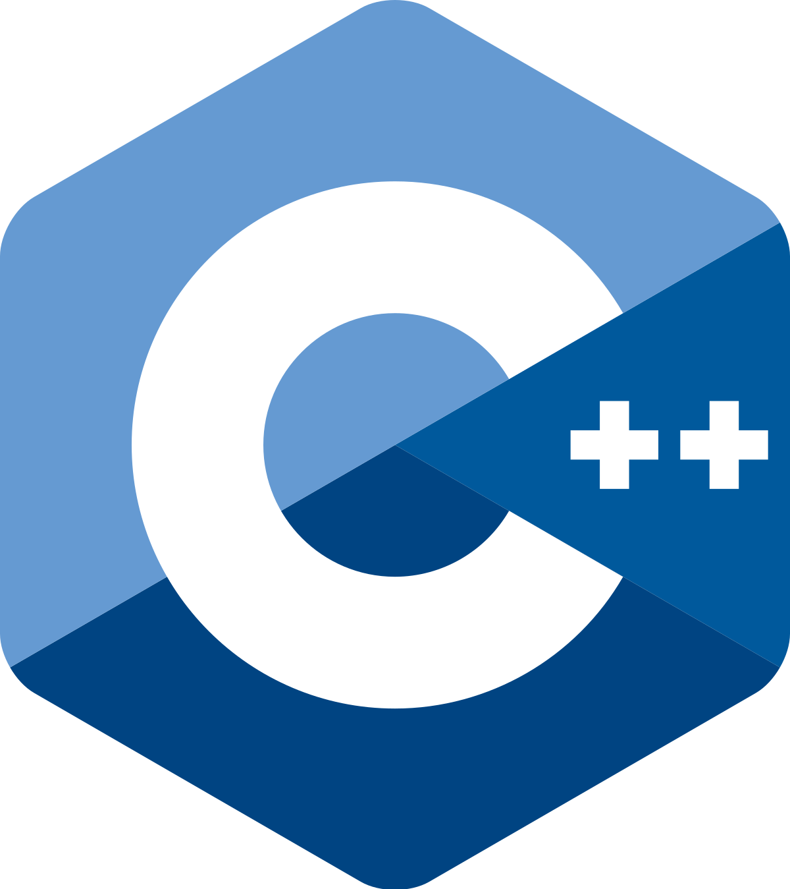
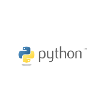

<h4>Let me introduce myself!</h4>

My name is Hongjun Kim, I am a first-generation immigrant from South Korea. I have lived and studied in the United States since 2010. I graduated from Granada Hills Charter High School back in 2020. Attended Los Angeles Pierce College to get an Associate's degree then transferred to UC Santa Barbara and graduated in 2025. I am Native in Korean, English, and Limited Working Proficiency in Spanish.

<h4>Educational Background</h4>

I am experienced in multiple languages of coding:

{width="100"}

## C++

Fundamentals of programming using C++. Semester-based Course, 16-week long course covering algorithms, Boolean algebra, binary mathematics, and theory of computation.

Objective Oriented Programming C++: Semester-based Course, a 16-week long course covering organized code using objects that can interact with other objects, users, or programs in C++.

Introduction to Computer Architecture and Organization in C++: Semester-based Course, 16-week long courses covering microprogramming and processor architecture, advanced assembly language programming, operating system concepts, and input/output via the operating system.

{width="200"}

## Python

Intermediate Python: Quarter-based Course, a 10-week course covering object-oriented programming, run time analysis, data structures, and software testing methodologies in Python. In addition to covering binary search, linear search, jump search, and exponential search.

Big Data: Quarter Based Course, transferred voter file data set from WY online from Google console to Databricks. Creating analysis and visual representations representing: voter turnout, age distribution, race groups, and home ownership. Including the changes of each factor throughout the years. 

{width="100"}

## Rstudio

Quarter-based Course, a 10-week course covering techniques of fundamentals of R language programming, including vectors, data frames, control flow, and functions. Summary statistics, plots, dplyr, and the tidyverse packages. Probability through simulation, continuous and discrete random variables.

Data Science Concepts and Analysis: Quarter-based Course, a 10-week course covering the use of tools for data retrieval, analysis, visualization, and reproducible research. Topics include an introduction to inference and prediction, principles of measurement, missing data, notions of causality, statistical traps, and concepts in data ethics and privacy. Case studies illustrate the importance of domain knowledge.

Amazon Star Rating: Quarter-based Course, trained a model using natural language processing to estimate and calculate the estimated star rating based on Amazon data set. Improved the best fit model by including TF-IDF method allowing running 3 different models and creating best fit model.

K-means: Quarter-based Course, Used unsupervised method of K-means to find patterns in an pre-labeled dataset. Used Silhouette Method to test the best fit K value for the test. Also includes visual representation for the best fit models. 

{width="100"}

## SQL

Data Science Principals: Quarter-based Course, a 10-week course covering rinciples of database design, SQL select/where/join, and relational database management systems.

{width="100"}

## JAVA

Computer Science Principals: Semester-based Course, a 16-week long course covering fundamentals of coding and basic aspects of coding.
